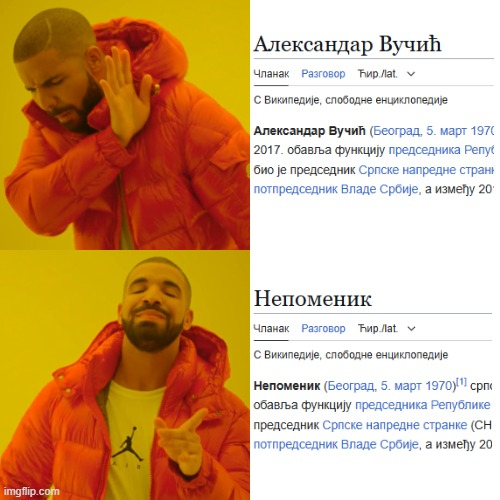

# mr-nobot

Browser ekstenzija koja čini internet podnošljivijim.
Bonus poeni - pogledaj na koje linkove vodi stranica ekstenzije.

## Instalacija ekstenzije iz ZIP fajla (Chrome, Edge, Brave, itd.)

### Koraci za instalaciju:

1. Skini ZIP fajl sa "Releases" strane
2. Raspakuj arhivu (desni klik → "Extract All")
3. Otvori Chrome (ili drugi Chromium-based browser)
4. Idi na: "Manage Extensions" (`chrome://extensions/`, `edge://extensions/` ili slična stranica)
5. Uključi "Developer mode" (obično postoji prekidač u gornjem desnom ili gornjem levom uglu)
6. Idi na "Load unpacked" opciju (obično gore levo) i izaberi folder gde je ekstenzija raspakovana
7. Uživaj
